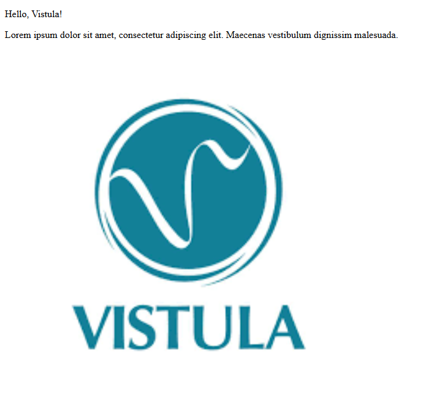

# First Project

A Java-based web application built with **Spring Boot** and **Maven**. This project serves as a foundational implementation, demonstrating the integration of backend logic with HTML-based frontend components.

## 🛠 Tech Stack
* **Backend:** Java 17+
* **Framework:** Spring Boot
* **Build Tool:** Maven
* **Frontend:** HTML / Template Engine (Thymeleaf)

---

## 🚀 Getting Started

### Prerequisites
* **Java Development Kit (JDK)** 17 or higher.
* Git installed on your local machine.

## 📂 Project Structure
* `src/main/java` — Source code including controllers and business logic.
* `src/main/resources` — Configuration files and HTML templates.
* `.mvn/wrapper` — Files required for the Maven Wrapper.
* `pom.xml` — The Maven Project Object Model file containing dependencies.

## 📸 Preview

